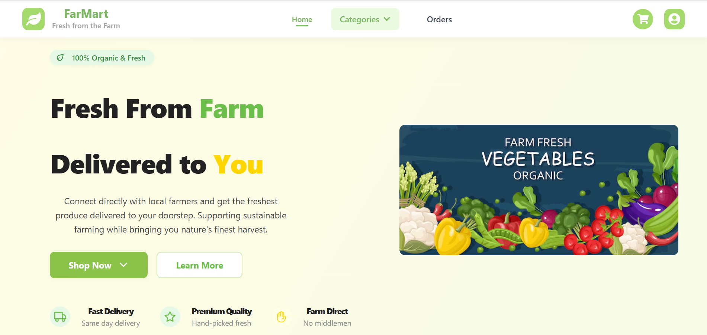

# 🌾 FarMart – B2B Farmer & Buyer Portal

FarMart is a full-stack B2B e-commerce platform built using the MERN stack that connects local farmers directly with institutional buyers. The platform is designed to simplify and modernize the agricultural supply chain by enabling seamless procurement, secure payments, AI-driven crop suggestions, and real-time logistics tracking.

It offers dedicated dashboards for farmers and buyers, providing an intuitive interface for managing crop listings, placing bulk orders, processing transactions, and tracking deliveries. Additionally, the platform integrates live market prices and weather data to support smarter, data-informed decisions.

---

## 🚀 Project Overview

FarMart is designed to digitize the agricultural supply chain by providing:

- 👨‍🌾 A farmer-friendly interface for listing crops and receiving orders.
- 🏢 Buyer tools to view crop listings, place bulk orders, and track deliveries.
- 💳 Razorpay integration for secure, real-time payments.
- 📦 Porter API for live delivery tracking.
- 🌱 AI-based crop recommendation based on soil data (95% accuracy).
- 📊 Live market price and weather data for planning and forecasting.

---

## 📸 Screenshots

> 📍 Below are the UI screenshots for both **Farmer** and **Buyer (Customer)** dashboards. Replace the image paths with actual image files or hosted URLs.

---

### 👨‍🌾 Farmer Dashboard

| Crop Management | Add Crop | Order Requests |
|------------------|----------|----------------|
|  |  |  |

---

### 🛒 Buyer (Customer) Dashboard

| Home / Crop Listings | Order Placement | Order Tracking |
|------------------------|-----------------|----------------|
|  |  |  |

> ℹ️ Tip: Store your images in a `screenshots/` folder at the root of your project. Use optimized `.png` or `.webp` files for best performance.

---

## 🛠️ Tech Stack

| Category       | Technologies |
|----------------|--------------|
| **Frontend**   | React.js, CSS|
| **Backend**    | Node.js, Express.js |
| **Database**   | MongoDB |
| **APIs**       | Razorpay API, Porter API, OpenWeatherMap, Web Scraping (Market Prices) |
| **AI/ML**      | Python (Scikit-learn), Pandas, Jupyter (for training), Flask (for API integration if applicable) |
| **Deployment** | Render |

---

## 🧪 Features

- 🔐 **User Authentication & Roles** – Farmers and buyers have separate dashboards.
- 🚚 **Smart Logistics** – Integrated Porter API for last-mile delivery updates.
- 🤖 **AI Recommendations** – Predicts high-yield crops based on soil mineral content.
- 📈 **Market Intelligence** – Scrapes real-time government crop price portals.
- 🌦️ **Weather-Based Planning** – Integrated weather forecasts for informed decisions.

---

## 🛠️ Installation Guide

```bash
# 1. Clone the repository
git clone https://github.com/yashr6577/FarMart_WebApp.git

# 2. Install server dependencies
cd Backend
npm install

# 3. Install client dependencies
# For Farmer Frontend
cd ../Farmer
npm install

# For Customer Frontend
cd ../Customer
npm install

# 4. Setup environment variables (example .env)
# For backend/.env
PORT=5000
MONGODB_URI=your_mongodb_uri
RAZORPAY_KEY=your_razorpay_key
RAZORPAY_SECRET=your_razorpay_secret
PORTER_API_KEY=your_porter_key

# 5. Run the application
# In backend folder
npm start

# In frontend folders (in another terminal)
npm run dev

---

## 📈 AI Crop Recommendation (Bonus)

- 🧠 Model trained on soil nutrient datasets to recommend optimal high-yield crops.
- 🔗 Exposed via **Flask REST API** and integrated into the React frontend.
- 🎯 Achieved **95%+ prediction accuracy** using Decision Tree and Random Forest algorithms.
- 🧪 Technologies: Python, Pandas, Scikit-learn, Flask

---
